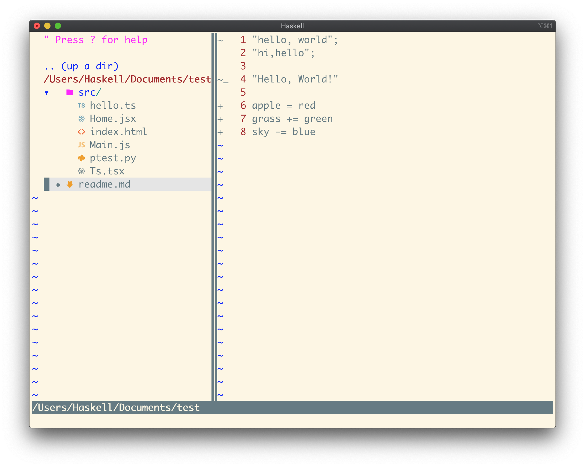
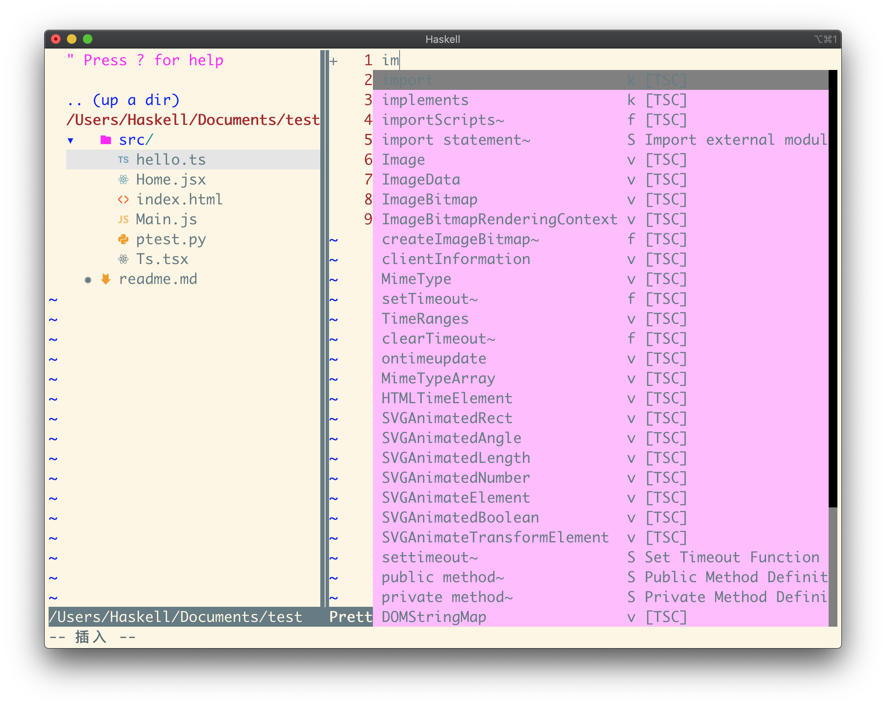
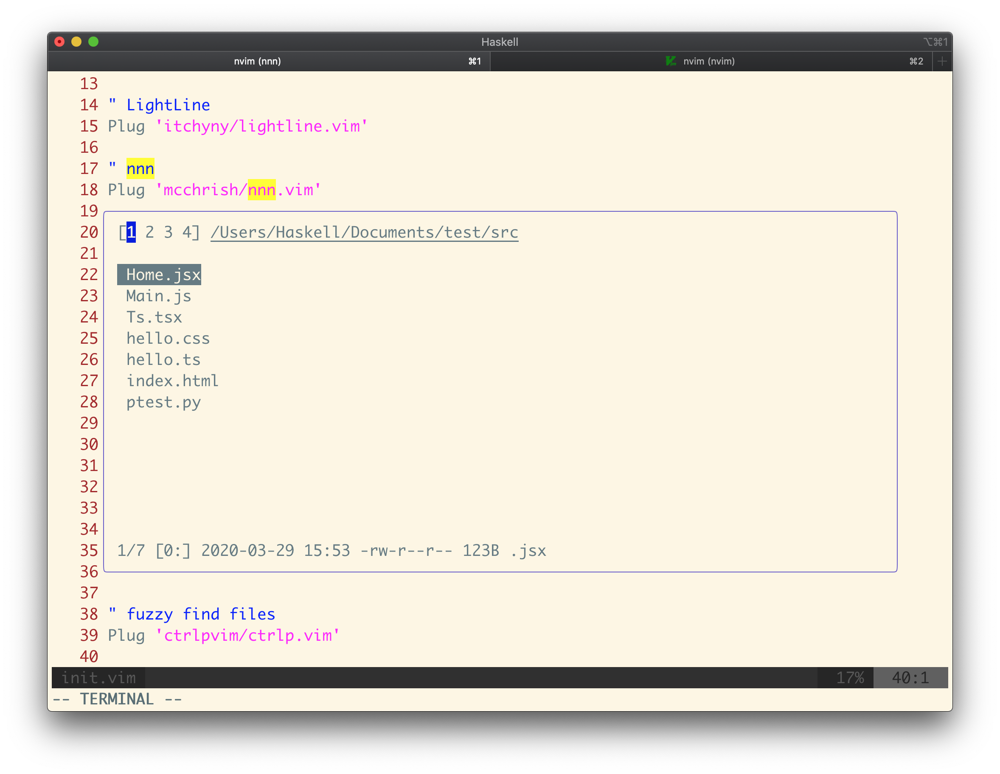

### Introduce
[NeoVim](https://neovim.io) configuration.
### Feature
* Language auto-complete, like JavaScript, TypeScript, Python, Elm, PureScript and Tsx, Jsx type file of the ReactJS.
* Auto-format on save for JavaScript, TypeScript, CSS, Markdown, GraphQL, Tsx, Jsx type file.
* Syntax highlight for 140+ languages.
* Menu management in a fast && beautiful way.
* Show the git diff in the sign column.
* Navigate between different tabs in a fast way.

### Screenshot

### Usage
1. **Install** [iTerm2](https://www.iterm2.com/downloads.html), [OhMyZsh](https://github.com/ohmyzsh/ohmyzsh#basic-installation) and [powerlevel10k](https://github.com/romkatv/powerlevel10k) (Recommend tools).
2. **[Install NeoVim](https://github.com/neovim/neovim/wiki/Installing-Neovim)**.
3. **[Install vim-plug](https://github.com/junegunn/vim-plug#neovim)**, which is the Vim plugin manager.
4. **Git Clone**
    * Go to the home folder with command `cd ~/`. 
    * Check the `.config` folder. if not exist, create one. 
    * Go to the `.config` folder. Run `git clone git@github.com/OhCoder/neovim-config.git nvim`.
5. **Install Plugin**
    * Run `nvim` command to open a NeoVim window.
    * Run command `:PlugInstall` under the window to install all the vim plugins.(more vim-plug reference, see [the doc](https://github.com/junegunn/vim-plug#commands))
6. **Happy coding!**

### Feedback
Welcome to feedback, :)